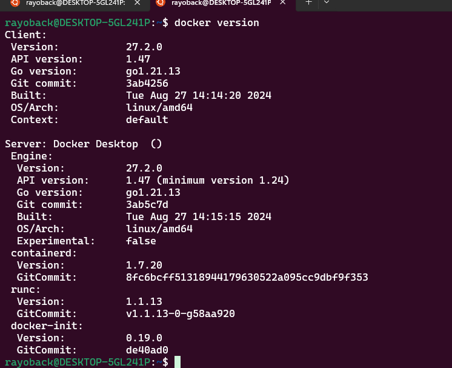

# 1. PRACTICA DE CONTENEDORES 

## 2. DURACION 24 MINUTOS 

# 3. DESCRIPCION.

La comunicación entre contenedores en redes de contenedores se logra a través de la creación de redes virtuales. Docker ofrece herramientas para definir y gestionar estas redes, lo que permite que múltiples contenedores interactúen entre sí de manera controlada y segura. Al conectar varios contenedores en una red virtual local.

En esta práctica, se configurará una red local para enlazar dos contenedores, mostrando cómo Docker maneja la comunicación interna entre aplicaciones que pueden estar ejecutando diferentes servicios.

# 4. ANALISIS.

Se requiere tener conocimientos básicos de Docker, que incluyen imágenes, contenedores y comandos esenciales (como docker run, docker ps, docker stop, docker rm). También es útil tener familiaridad con redes y direcciones IP, así como conocimientos básicos de la línea de comandos.

# 5. OBJETIVOS CLAVES.

Creamos y gestionar una red local en Docker, esto nos va a permitir habilitar la comunicación entre contenedores.  
Ejecutar y configurar dos contenedores conectados a una red Docker.  
Verificar la conectividad y el intercambio de datos entre contenedores en la misma red.

# 6. EQUIPO Y SISTEMA QUE VAMOS A UTILIZAR.

- Computadora con Docker Desktop o Docker Engine instalado y configurado.
- WSL 2 (si se está trabajando en Windows 10 o superior).
- Acceso a la terminal (cmd, PowerShell o terminal de Linux).

# 7. MANUAL DE INSTRUCTIVO.

Documentación oficial de Docker sobre redes de contenedores: [Docker Networking](https://docs.docker.com/network/), [Docker CLI Reference](https://docs.docker.com/engine/reference/commandline/cli/).

# 8. PROCESO.

Verifica la versión de Docker instalada en nuestro sistema.

Para iniciar con PostgreSQL, utiliza el comando (según tu necesidad).

Para asegurarnos de que la imagen está instalada, ejecuta `docker ps` para ver las imágenes disponibles.

Usamos el siguiente comando, podemos utilizar cualquier correo electrónico que deseemos. Es importante que guardes el correo y la contraseña utilizados.

 

Luego, creamos nuestra propia red con el siguiente comando: `docker network create --attachable redinterna`, y conecta los contenedores ejecutando:

 

Luego, abrimos el navegador y nos dirigimos a `localhost:8090`, donde se abrirá PgAdmin. Iniciamos sesión utilizando el correo electrónico y la contraseña que configuramos previamente.

Una vez que hemos ingresado, creamos una **BASE DE DATOS**.

 

Nos mostrará la siguiente pantalla para dar inicio a crear la **BD**.

 

Luego, en esa **BD**, creamos una tabla y agregamos posteriormente sus atributos.

 
 

Ya estando cerrada, le corremos para verificar que nuestra **BASE DE DATOS** creada con sus atributos sí funcione.

# 9. RESULTADOS ESPERADOS.

Los dos contenedores están conectados a la misma red local, lo cual es bueno, ya que ese es el objetivo de esta práctica.

# 10. BIBLIOGRAFIA.

Docker Inc. "Networking overview." Docker Documentation. https://docs.docker.com/network/  
Official Docker CLI Reference. Docker Documentation. https://docs.docker.com/engine/reference/commandline/cli/

 
 
  
  

